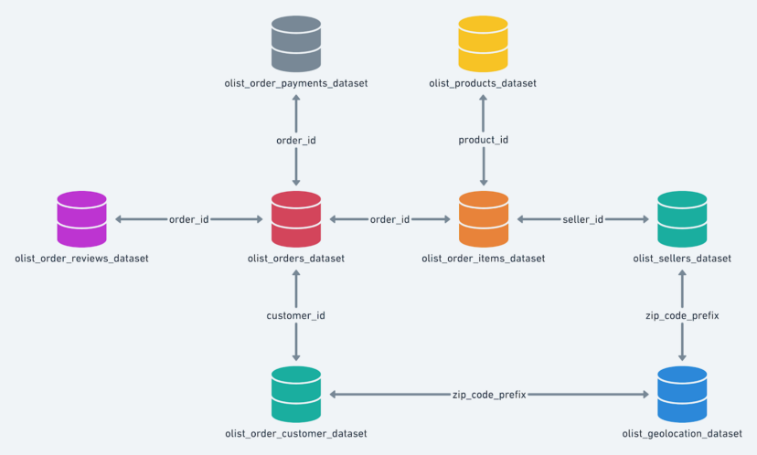

<!-- PROJECT LOGO -->
 

 </a>
 <h1 align="center">Capstone Project: ETL Pipeline for a Brazillian E-Commerce</h1>
 

  Udacity Nanodegree
   
  <a href=https://github.com/BinariesGoalls/Udacity-Data-Engineering-Nanodegree><strong>Explore the repository»</strong></a>
   
   
 

<!-- ABOUT THE PROJECT -->

## Project Summary

Olist is a Brazilian startup with headquarter in Curitiba. Its business model is of the e-commerce type, with the main objective of helping people who sell a product to find buyers in all Brazilian e-commerce.

Olist has been growing a lot in recent years, due to the increase in new users and also the increase in transactions on its platform. And a company's growing pains are inevitable, especially with data.

The whole system extends its capacity, both in terms of processing and in terms of data storage, and consequently the query time to databases increases, impacting the speed of analysis and the time to update metrics in dashboards.

The objective of this project was to create an ETL pipeline on the olist datasets to create a analytic Data Warehouse on Amazon Redshift. A use case for this analytic database is to find answers for some questions such as "Has the amount of sales has increased over time?", "Which product categories are top sellers?", "What is the total turnover?", et cetera.

With this in mind, the project will follow these steps:

* Step 1: Scope the Project and Gather Data
* Step 2: Explore and Assess the Data
* Step 3: Define the Data Model
* Step 4: Run ETL to Model the Data
* Step 5: Complete Project Write Up

### Step 1: Scope the Project and Gather Data
#### Scope

In this project, we will aggregate the total of eight datasets that represents each one of the tables from the Olist e-commerce OLTP database, with the objective to model this source of data into “Fact” and “Dimension” tables for the analytics team.

The final solution proposed is a pipeline built upon Python for ingesting data from Amazon S3 into a Redshift Data Warehouse, running transformations on Redshift and saving them into a proposed Star Schema model.

#### Describe and Gather Data

**Data Source**  

Brazilian E-Commerce Public Datasets by Olist  

https://www.kaggle.com/datasets/olistbr/brazilian-ecommerce

**Content**  

Olist is the largest department store on marketplaces. It has a catalog with over 950,000 products, hundreds of thousands of orders and a network of over 9,000 partner retailers spread across all regions of Brazil. 

All the files use the CSV format.

**Model**  

The data sources are the company's e-commerce OLTP system tables, you can check the ERD of the system in the figure below.

### Step 2: Explore and Assess the Data

Please refer to [inspection_notebook.ipynb](https://github.com/BinariesGoalls/Udacity-Data-Engineering-Nanodegree/blob/main/Capstone%20Project/inspection_notebook.ipynb).

### Step 3: Define the Data Model
#### 3.1 Conceptual Data Model

Since the purpose of this data warehouse is for OLAP and BI app usage, we will model these data sets with star schema data modeling, the proposed data model consists of the following tables:

* Fact table:
    * fact_oders (order_id, product_id, date_key, seller_id, payment_key, customer_id, freight_value, price, order_items_qtd, order_status)  
   
* Dimension tables:
    * dim_products (product_id, product_category_name)
    * dim_date (date_key, date, year, quarter, month, day, week, is_weekend) 
    * dim_sellers (seller_id, seller_zip_code_prefix, seller_city, seller_state, seller_geo_lat, seller_geo_lng)          
    * dim_payments (payment_key, order_id, payment_sequential, payment_type, payment_installments)
    * dim_customers (customer_id, customer_zip_code_prefix, customer_city, customer_state, customer_geo_lat, customer_geo_lng)

   

#### 3.2 Mapping Out Data Pipelines

The pipeline consists on the following steps:

* Store the data into Amazon S3
* Stage the data from S3 to Redshift
* Perform the necessary transformations for storing it in the corresponding tables in the Star Schema
* Do quality checks on the data

### Step 4: Run Pipelines to Model the Data 
#### 4.1 Create the data model

Data processing and data model was created in Python.

Please refer to:
* [create_tables.py](https://github.com/BinariesGoalls/Udacity-Data-Engineering-Nanodegree/blob/main/Capstone%20Project/create_tables.py)
* [etl.py](https://github.com/BinariesGoalls/Udacity-Data-Engineering-Nanodegree/blob/main/Capstone%20Project/etl.py)

#### 4.2 Data Quality Checks

The quality checks performed mainly check the load and quantity of records in the fact and dimension tables.

Please refer to [test_queries.ipynb](https://github.com/BinariesGoalls/Udacity-Data-Engineering-Nanodegree/blob/main/Capstone%20Project/tests_queries.ipynb)

#### 4.3 Data Dictionary

##### dim_date table
* date_key: primary key generated from the timestamp of the order
* date: date of the order
* year: year of the order
* quarter: quarter of the order
* month: month of the order
* day: day of the order
* week: week of the order
* is_weeknd: indicator if it is weekday or not

##### dim_products table
* product_id: primary key, identifier of the product
* product_category_name: category description of the product

##### dim_sellers table
* seller_id: primary key, identifier of the seller
* seller_zip_code_prefix: seller address zip code description
* seller_city: seller address city description
* seller_state: seller address state description
* seller_geo_lat: seller address latitude location value
* seller_geo_lng: seller address longidute location value

##### dim_payments table
* payments_key: primary key, generated identifier for the payment
* order_id: foreign key, identifier of the order linked to payment
* payment_sequential: payment sequential
* payment_type: payment type description (credit card, et cetera)
* payment_installments: number of installments of the payment

##### dim_customers table
* customer_id: primary key, identifier of the customer
* customer_zip_code_prefix: customer address zip code description
* customer_city: customer address city description
* customer_state: customer address state description
* customer_geo_lat: customer address latitude location value
* customer_geo_lng: customer address longidute location value

##### fact_orders table
* order_id: primary key, identifier of the order
* product_id: foreign key, identifier of the product linked to the order
* date_key: foreign key, identifier of the date register linked to the order
* seller_id: foreign key, identifier of the seller linked to the order
* customer_id: foreign key, identifier of the customer linked to the order
* freight_value: order product freight value 
* price: order product price
* order_items_qtd: order products quantity description
* order_status: current status of the order

### Step 5: Complete Project Write Up

#### Tools and Technologies
1. AWS S3 for data storage
2. AWS Redshift as Data Warehouse
3. Python
4. PostgreSQL
5. Jupyter Notebooks

#### Data Update Frequency
1. Depending on how frenquently you would like to inspect Data Engineering jobs, we could feed data into the corresponding S3 buckets and generate the reports. A weekly schedule should be enough for checking how the market is changing.
2. All tables should be update in an append-only mode.

#### Future Design Considerations
1. The data was increased by 100x.
	
If the data was increaed by 100x an alternative is to use Spark alongside [AWS EMR](https://aws.amazon.com/tw/emr/?nc2=h_ql_prod_an_emr&whats-new-cards.sort-by=item.additionalFields.postDateTime&whats-new-cards.sort-order=desc) which is a distributed data cluster for processing large data sets on cloud.

2. The data populates a dashboard that must be updated on a daily basis by 7am every day.

In this case we can build a pipeline using [Apache Airflow](https://airflow.apache.org) to regularly update the data and populate a report. Apache Airflow also integrate with Python and AWS very well. More applications can be combined together to deliever more powerful task automation.

3. The database needed to be accessed by 100+ people.

For this case we can still use [AWS Redshift](https://aws.amazon.com/tw/redshift/?nc2=h_ql_prod_db_rs&whats-new-cards.sort-by=item.additionalFields.postDateTime&whats-new-cards.sort-order=desc), it handles up to 500 connections. If this SSOT database will be accessed by 100+ people, we can move this database to Redshift with confidence to handle this request. Cost/Benefit analysis will be needed if we are going be implement this cloud solution.

---

### How to run

Follow the steps to extract and load the data into the data model.

1. Navigate to `Capstone Project` folder
2. Create a S3 bucket on AWS
3. Create a cluster on AWS Redshift
4. Create a IAM user
5. Create a IAM role giving the correct acesses to S3 and Reshift
6. Link the role with the S3 bucket and the Redshift cluster
7. Fill the information on the `dwh.cfg` file
8. Upload the datasets on the S3 bucket
9. Run `create_tables.py` to create/reset the tables.
10. Run `etl.py` process and load data into database.This will execute SQL queries corresponding to staging data from S3 on Redshift and to transform and insert into the Postgres tables on Redshift.
11. Run queries on the notebook `tests_queries.ipynb` to validate the entry of data into tables.

<!-- CONTACT -->

## Contact

Alisson lima - ali2slima10@gmail.com

Linkedin: [https://www.linkedin.com/in/binariesgoalls/](https://www.linkedin.com/in/binariesgoalls/)
